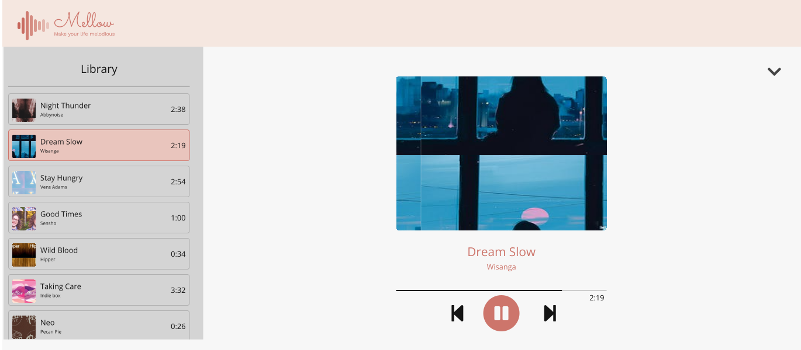

# Mellow Music Player

## Overview

Mellow Music Player is a web-based music player designed for relaxation and development purposes. This player features a collection of limited royalty-free music tracks and provides a responsive and interactive interface that you'll love.

## Features

- **Music Playback**: Enjoy a curated collection of royalty-free music tracks.
- **Responsive Design**: The music player adapts to different screen sizes for a seamless experience on all devices.
- **Interactive Controls**: Play, pause, skip tracks, adjust volume, and explore music categories.
- **Track Information**: View details about the currently playing track.

## Technologies Used

- **HTML**: The structure of the music player is defined using HTML.
- **CSS**: CSS is used for styling the player's responsive interface.
- **JavaScript**: JavaScript powers the interactive controls and music playback.

## Live Site

[Listen here}(https://kishan-kr.github.io/mellow/)
